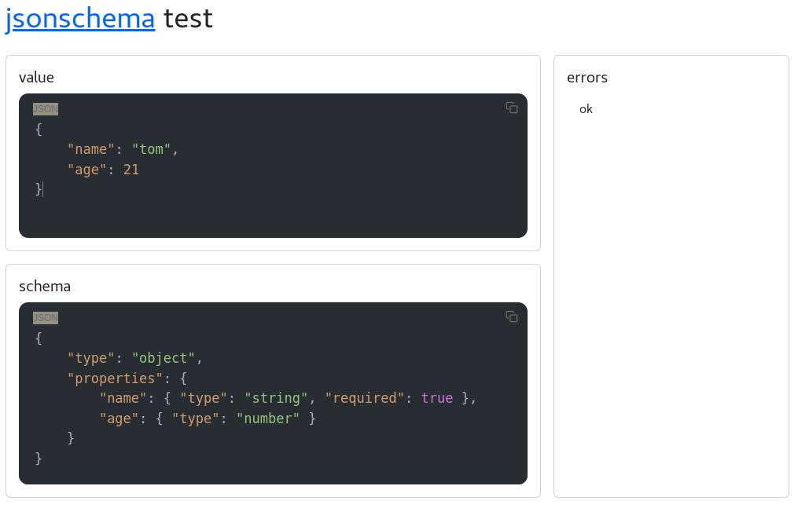

# testschema

validate and display errors about your JSON value.

thanks [jsonschema specifications](https://www.npmjs.com/package/jsonschema).




## Project setup
```
npm install
```

### Compiles and hot-reloads for development
```
npm run serve
```

### Compiles and minifies for production
```
npm run build
```

### Customize configuration
See [Configuration Reference](https://cli.vuejs.org/config/).
